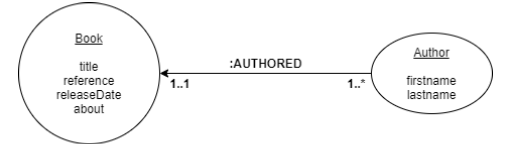

<!-- PROJECT LOGO -->
<br />
<p align="center">
  <a href="https://gitlab.mindsapp.io/Brahim.Sliti/tinylibrary">
    
  </a>

  <h3 align="center">Spring Boot Tiny Library RESTful API.</h3>
</p>

# Tiny Library

Tiny Library is a Spring Boot and Neo4J RESTful API enabling yout to manage your library books to the next level:

* Add a book to your stock.
* Update a book.
* Get all details of a book.
* Search for books with title, reference, release date and author's name.
* Get all books of a specific author wrote with a signle HTTP request!

## Table of Contents

* [Built with](#built-with)
* [Models design](#models-design)
* [Getting Started](#getting-started)
  * [Docker installation (recommended)](#docker-installation-recommended)
    * [Prerequisites](#prerequisites)
    * [Installation](#installation)
  * [Local installation](#local-installation)
    * [Prerequisites](#prerequisites)
    * [Installation](#installation)

## Built with

* [Spring Boot](https://spring.io/projects/spring-boot)
* [Neo4J](https://neo4j.com/)

## Models design

<br/>
<p align="center">
  
</p>

Above is the design used for Book and Author model relationships.

## Getting Started

To run this application, you can either run it on your local machine with your already installed JDK and Neo4J database or use Docker to set up the application in just a few seconds (recommended way)!

### Docker installation (recommended)

(Tested and working on OSx, not tested on Windows.)

#### Prerequisites 
* Have Docker installed
* Have `docker-compose` installed
* Make sure your don't have a current Neo4J database running on your local system. If it is, please edit the NEO4J host port parameters set in `docker-compose.yaml`

#### Installation

1. Clone the repo
```sh
git clone https://gitlab.mindsapp.io/Brahim.Sliti/tinylibrary.git
```

2. Edit the ``src/main/resources/application.properties`` file so it looks like the above example
```
# spring.data.neo4j.username=neo4j
# spring.data.neo4j.password=password
# Please if you want to run this application with the docker-compose neo4j service,
# comment out the above username and password settings and uncomment the bellow one
spring.data.neo4j.uri=bolt://neo4j:7687
```

3. Build the jar file
```sh
./mvnw clean package
```

4. Build the docker image
```sh
docker build -t spring-tiny-library-api .
```

5. Build and run the ``docker-compose`` services
```sh
docker-compose build && docker-compose up -d
```

6. Wait a few seconds so the services start properly and navigate to
``http://localhost:8080``.
There you can discover the available endpoints and request them.

### Local installation

#### Prerequisites

* JDK version 1.11 or later installed
* Maven 3.6.3 or later installed
* A Neo4J database running on the port ``7687`` with connection credentials as ``username`` = ``neo4j`` and ``password`` = ``password``.

You can edit the Neo4J connection parameters in ``src/main/resources/application.properties`` file.


#### Installation

1. Clone the repo
```sh
git clone https://gitlab.mindsapp.io/Brahim.Sliti/tinylibrary.git
```

2. Run the application from your IDE (tested and working on IntelliJ IDEA)

3. Wait a few seconds so the services start properly and navigate to
``http://localhost:8080``.
There you can discover the available endpoints and request them.